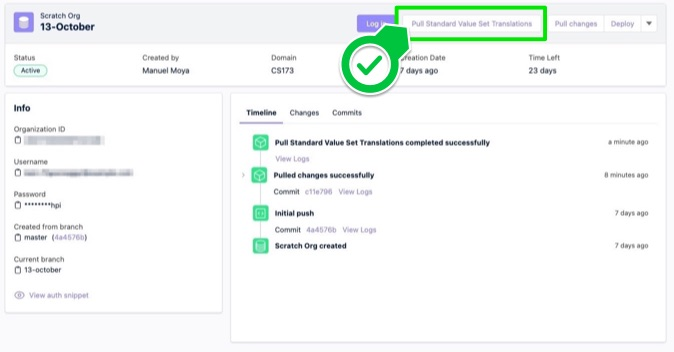

# Hutte Recipe - Pull and Commit Standard value set translations

The pull/retrieval of `Standard Value Set Translations` through the Salesforce CLI cannot be successfully achieved through commands which use source tracking, details can be seen in the [known issue](https://issues.salesforce.com/issue/a028c00000qQ0VAAA0/unable-to-retrieve-the-standardvaluesettranslation-values-using-cli). This limitation impacts Hutte's logic for the pull changes operation of this metadata type.

As a workaround, Hutte custom buttons can help to fix and automate this operation, by providing the custom logic for the pull and commit of this metadata type as a custom button in `hutte.yml` file.



## Prerequisites

- a valid Sfdx Project
- a `hutte.yml` file (e.g. the default one shown in the `CONFIGURATION` tab)

## Steps

### Step 1

- Edit the `hutte.yml` file in your default branch
- Add the following lines to the `custom_scripts`
- Push it to your main branch

```yaml
custom_scripts:
  # This scripts will be displayed on the scratch org's page
  scratch_org:
    'Pull Standard Value Set Translations':
      description: "Import data using Snowfakery"
      run: |
        sf project retrieve start --metadata 'StandardValueSetTranslation:*' --target-org "${SALESFORCE_USERNAME}"
        git add .
        git commit -m "chore: standard value set translations"
        git config --global push.autoSetupRemote true
        git push
```

*Note 1: If your project still uses `sfdx`, replace the `sf` command by `sfdx force:source:retrieve --metadata 'StandardValueSetTranslation:*' --targetusername "${SALESFORCE_USERNAME}"`. In Hutte, the salesforce cli version is defined by the docker image used, which can be updated in the Project Settings menu.

*Note 2: This custom button can also be added to sandboxes page in Hutte, for that, add the button to `sandbox` instead of `scratch_org`

### Step 2

- Create a Scratch Org
- Use the `Pull Standard Value Set Translations` to pull and commit the standard value set translations
